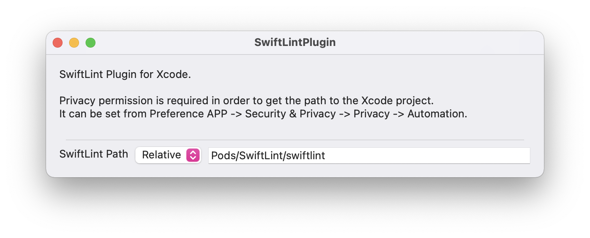

#  SwiftLint Xcode Plugin

## Demo
### AutoCorrect All Files

### AutoCorrect Current File

### AutoCorrect Selected Range

## Usage
1. Set SwiftLint Path
- default: Default path is `/usr/local/bin/swiftlint`
- relative: Relative path with the current project folder as the basis.
- custom: Absolute path

